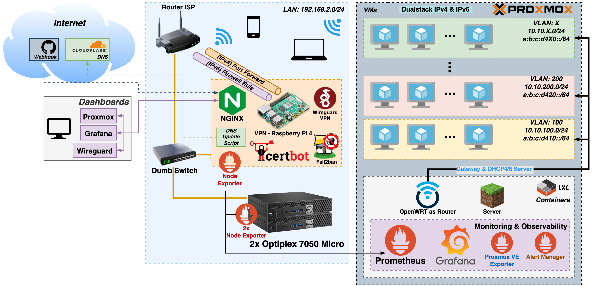
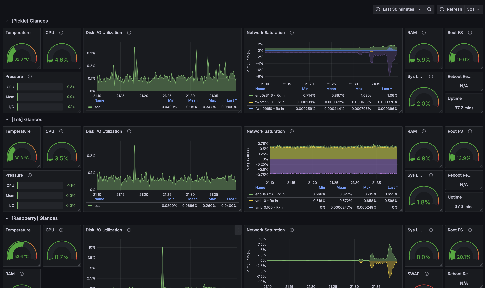
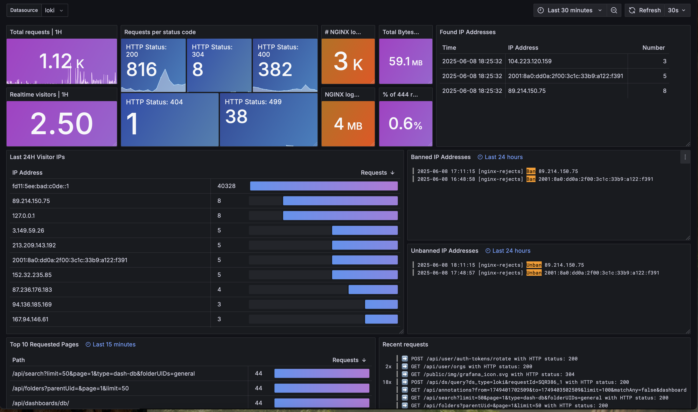

# Homelab

# Router for the VLANs network.
[OpenWRT Config](./openwrt_config.md)

I use OpenWRT as a router to route traffic for the VMs in the different VLANs i assign them to.
I want them to have their own isolated network, but also be able to access the internet.

Im in the process of learning more firewall rules and restricting them further.

# Rasberry Pi as a VPN

Since I want to connect to my homelab from outside my house, but dont want to expose neither of the proxmox dashboards, I'll only expose a VPN tunnel.
That way, it will be as if I'm on my usual LAN network inside my house and dont need to expose anything to the Internet.

I bought a simple Raspberry Pi 4 with only 1Gb to serve as the VPN server, which is running Wireguard and is connected to the same switch as the mini pc's.
Its running Raspberry PI OS Lite headless, using 90Mb of RAM on idle. I installed the Wireguard VPN via PiVPN. Im still debating on wether to install WGDashboard to have a prettier interface to manage the VPN, although it doesnt need much GUY management at all.

# Wake On LAN

I've yet to measure the power draw from both the minipc's on idle when they are turned on but with no VMs running. 
Either way, they will for sure consume less energy if they are in a Wake on LAN mode.
That basically means that when I'm done with them I'll just `shutdown now` them, but they'll be able to be powered ON by another device.
That device will be the Raspberry Pi running the VPN, since he will be on 24/7. On it, I just have to run `wakeonlan device:mac:address` and the mini pc will boot.
[Wake on LAN utility](https://launchpad.net/ubuntu/+source/wakeonlan)

Setting up the devices to be Wake On LAN ready is pretty straightforward. I just referred to Dell's user manual. Keep in mind to disable the options they tell you to disable.
[Optiplex Wake On LAN](https://www.dell.com/support/kbdoc/en-us/000129137/wake-on-lan-wol-troubleshooting-best-practices)

# CPU performance

In an attempt to reduce the effective power draw form the CPU, since im not focused on very performant scenarios/deployments, I've used the [scaling-governor](https://community-scripts.github.io/ProxmoxVE/scripts?id=scaling-governor) script to my cpu scaling mode to powersave.

# Cloudflare Dynamic DNS records update

Up until recently I was using `no-ip` Dynamic DNS service to map a domain to my router's IPv4/6 addresses. My router's ISP even had a dedicated DDNS page to input `no-ip` credentials.
Anyway, with `no-ip` you have to manually confirm your DDNS subdomain every 30 days and you can only have one. Very tiring.

Since I had a Cloudflare domain of my own (`tiagobarros.xyz`), I created two more subdomains for my IPv4/6 addresses there (ex: `v4.tiagobarros.xyz`) and then used a script to update the addresses that those subdomains point to.

The script is not mine and is available here: [cloudflare-ddns-updater](https://github.com/K0p1-Git/cloudflare-ddns-updater.git)

To have this script running _all the time_, I setup a `systemd` service and timer. Those files are [here](./scripts/sytstemd/). It simply runs the script 1 minute after boot and then every 5 minutes.
The cloudflare update scripts were placed in `/usr/local/sbin`. Edit those accordingly to your case.

# Reverse Proxy

I finally decided to serve every webpage or dashboard behind a domain because I wanted a clean `HTTPS` connection.

For that reason I decided to learn a bit about `nginx`, install, and configure it to sit in front of my Homelab's services and terminate TLS connections.
It was rather easy, mostly because I didn't do incredibly complex stuff. Just configure it to listen on `443`, serve a specific domain, forward it inside. Only allow VPN or LAN clients, which was just 2 lines of configuration, plus another 2 to specify the certificate (more on that below).

I also decided to install `fail2ban` alongside it to ban any bad actor IP (http return codes 444/403). I don't expect much to be hitting my domains/address but still. It was also fun and easy to setup. 

# Certificates!

I now provide certificates for my Proxmox and Grafana dashboards, plus a Webhook for Github webhooks to trigger Jenkins stuff.
They are done with `certbot` and `Let's Encrypt`. It was painfully easy to set it up. They automatically generate certificates and auto-renew them for the new sub-domains I created in Cloudflare.

For example, my `proxmox.tiagobarros.xyz` sub-domain in Cloudflare is just a `CNAME` record pointing to `v6.tiagobarros.xyz`. Don't worry, as per `nginx` rules, only VPN clients and my own LAN can access it lol. `fail2ban` will also ban bad IP addresses.

Certbot has a dedicated python package to specifically renew domains/sub-domains from Cloudflare, hence why it was so easy. [Docs here!](https://certbot-dns-cloudflare.readthedocs.io/en/stable/index.html)

# Monitoring Stack: 
### Grafana | Prometheus | Loki | Node Exporter | Grafana Alloy

I setup [prometheus node exporter](https://github.com/prometheus/node_exporter), a custom node exporter for [Proxmox VE](https://github.com/prometheus-pve/prometheus-pve-exporter) and a Prometheus instance to scrape from all those exporters.

I also setup a Grafana instance to display some of those metrics. I took [this](https://grafana.com/grafana/dashboards/1860-node-exporter-full/) dashboard as inspiration and trimmed it down to only what I felt was relevant at a quick glance.
I left the full dashboard with all metrics configured too, though I barely look at it. The trimmed down one gives me all I need (for now at least).

Additionally, I wanted to monitor logs for `nginx` and `fail2ban`, so I head to install `Loki` alongside `Grafana Alloy`, which is the equivalent of Prometheus and Node exporter respectively.
This was a bit more tricky to create a dashboard to, since I had to fiddle with regex to filter the logs lines. [dashboard inspiration](https://grafana.com/grafana/dashboards/12559-loki-nginx-service-mesh-json-version/)

PS: This does not contain any sensitive information lol. Its just IP addresses.
